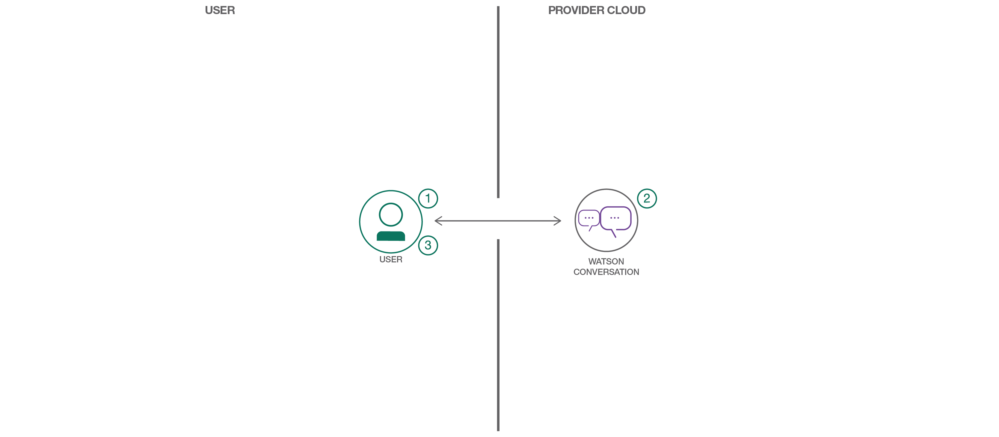

# 2018 Chatbot 101 Workshop
This is a chatbot 101 workshop with IBM Watson Assistant (aka conversation).

## about @blumareks

Marek Sadowski is a full stack developer advocate, a robotics startup founder and an entrepreneur. He has about 20 year experience in consulting largest enterprises in USA, Europe, Middle East and Africa as a senior engineer and an IT architect in mobile, web, Java and integration technologies. As a graduate from the International Space University Marek pioneered in a research on VR goggles for the virtual reality system to control robots on Mars in NASA Ames. He founded a startup to deliver robotics solutions and services for space, military, and industrial sectors.

## Setting up for Watson
You will need a free account on IBM Cloud to create and access Watson Services.
Please use this link to create it: 
IBM Cloud - [http://bluemix.net](https://ibm.biz/BdZivR) 

## Agenda

Some intro and examples of chatbots around us.
Watson 
Demo(s)
Hands-on

## Intro
Has anyone built a chatbot? 
Have you interacted with a chatbot?
Why chatbots? (for the non-believers to believe!)

Blade Runner, Space Odyssey 2001
EX_Machina, Transcdendence
Terminator, ...

Some simple demos
- car demo - https://conversation-demo.ng.bluemix.net
- cloudco - https://cloudco.mybluemix.net
- Android app - starterkit - https://console.bluemix.net/developer/mobile/starter-kits
- Star Trek Bridge Crew - Watson SDK for Unity (AR - VR) 

## IBM Watson
IBM Cloud - (http://bluemix.net)[https://ibm.biz/BdZivR] 
Watson AI services
IBM Watson Assistant 
Watson Tone Analyzer

## Hands-on

### Step 1: Designing Your Bot
    Design a simple set of Intents and Entities

### Step 2: Train Watson Conversation Service
    Intents
    Entities
    Dialog
    Context
    slots   
    Workspace ID

### Step 3: Patterns
Many patterns

https://github.com/IBM/watson-conversation-slots-intro

- Login to IBM Cloud, create Conversation Service
- Build a dialog, slots

### Step 4: Test Watson Conversation Service

Test dialog flow
Bot Asset Exchange - https://developer.ibm.com/code/exchanges/bots/
Deployment options [optional demo]
IBM Watson Assistant with Watson Tone Analyzer - https://github.com/watson-developer-cloud/food-coach

